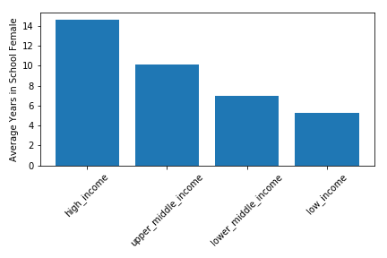
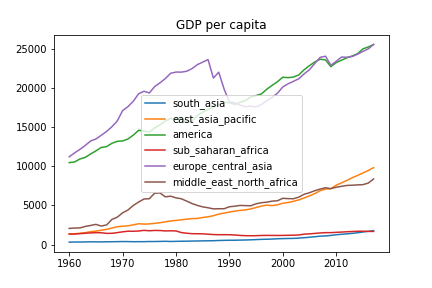
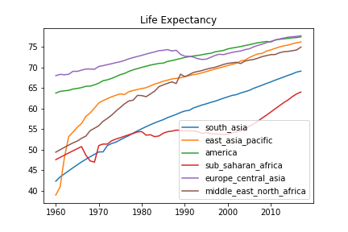
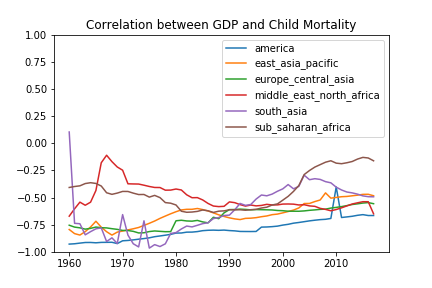
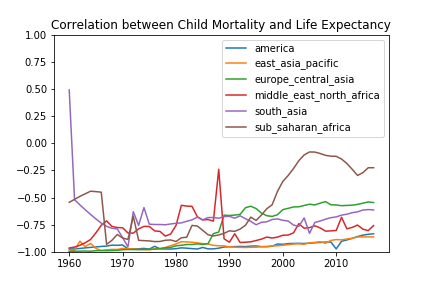

# DS5500 HW1
# Problem 1
Take the Gapminder Test: <http://forms.gapminder.org/s3/test-2018>
## What score did you received? Did any of the answers surprise you?
I got right only 3 out of the 13 questions.  
Many of the questions surprises me. If I have to pick one I will choose the ratio of 1-year-old children that are vaccinated. It seems the world a put a lot of effort to prevent the spread of preventable diseases.
## Choose a question from the test, re-state it, and answer it using visualization and summarization. Provide a figure and any relevant output with your answer.
**Restated Question:** How many years have women of age 30 spent in school for diffenrent income level?  

# Problem 2
Visualize the distribution of income (GDP / capita) across countries and continents, and how the distributionof income changes over time.
- Distribution of Income across countries

- Distribution of Income across continents

## Interpret the visualization and what you notice. Are they any notable trends and/or deviations from that trend?
## What caveats apply to your conclusions?

# Problem 3
Use visualization to investigate the relationship between income (GDP / capita), life expectancy, and child mortality over time.  
GDP per capita             |     Child Mortality       |  Life Expectancy in Years
:-------------------------:|:-------------------------:|:-------------------------
 |  | 

GDP vs child_mortality     |   GDP vs life_expectancy  |  child_mortality vs life_expectancy
:-------------------------:|:-------------------------:|:-------------------------
 |  | 
## How does each measure change over time within each continent?
### GDP vs Child Mortality
- There is a trend that these 2 variables become less negatively correlated.
### GDP vs Life Expectancy
- The 2 variables are becoming slightly less positively correlated.
### Child Mortality vs Life Expectancy
- The 2 variables are becoming less negatively correlated.
## Interpret your visualizations, noting any trends and/or outliers.
### GDP vs Child Mortality
- Lower GDP leads to higher child mortality, but this correlation have been more minor in recent years. The trend, however, is different in the region *Middle East North Africa* where it stay stables in the last 20 years. *South Asia* are having stronger correlation in recent years which is also different from other regions. This might simply means that child mortality are have equally dropped within these regions regardless of GDP.
### GDP vs Life Expectancy
- The correlation have a more significant drop in the region of *sub-Saharan Africa* and *South Asia* in recent years, which also are regions that also have less GDP comparing to others. It is possible that people in this region have same life expectancy regardless of GDP in recnt years.
### Child Mortality vs Life Expectancy
- Higher life expectancy are related to lower child mortality, but this correlation have become more minor. The correlation are even more minor in *sub-Saharan Africa* in recent years. Combining with the previous result in *GDP vs Life Expectancy*, we can see that life expectancy have little correlation with both GDP and child mortality in this region. This might indicate that the health care quality in this region are more affected by outside-organization, and need futher investigation.

# Problem 4
## Choose two variables you have not investigated yet, and visualize their distributions, their relationship with each other, and how these change over time.
In this question I will investigate the relationship between female labor participation and mean education years.  
- Labor Participation  

- Years in School  

- Correlation over Time  

## Interpret your visualizations, noting any trends and/or outliers.
Females in America, Europe and Australia have spent more time in school comparing to other regions. We can also see that countries where female spent more time in school also are involved in more labor participation.  
Exception exist in China and sub-Saharan Africa, where despite female participate more in labor but spent less time in school.  
From the correlation between the 2 variables over time, we can see that there is a positive relationship between these 2 factors, and the correlation is stable in the last 2 decades.

# Problem 5
## Did you use static or interactive plots to answer the previous problems?
I used static plots in all previous problems.
## Explore the data using the interactive visualization tools at <https://www.gapminder.org/tools>, and watch the TED talk “The best stats you’ve ever seen” at <https://www.youtube.com/watch?v=hVimVzgtD6w>.
## Discuss the advantages, disadvantages, and relative usefulness of using interactive/dynamic visualizations versus static visualizations.